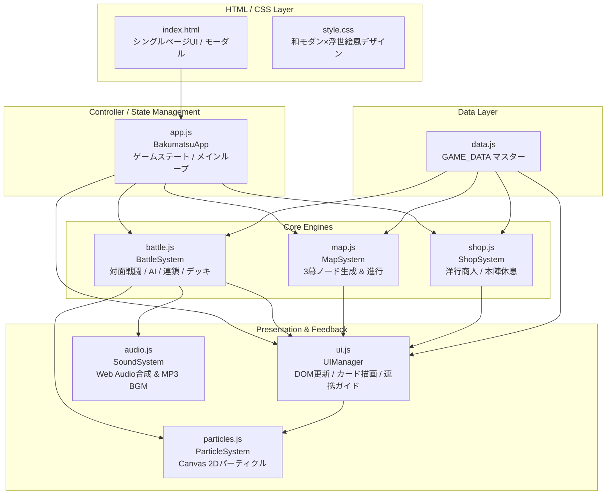
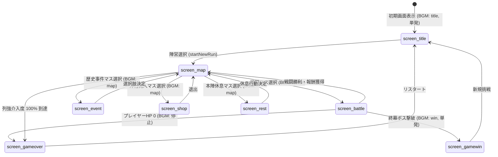
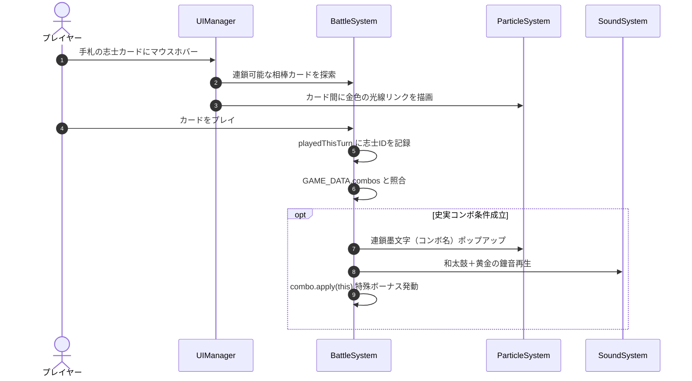
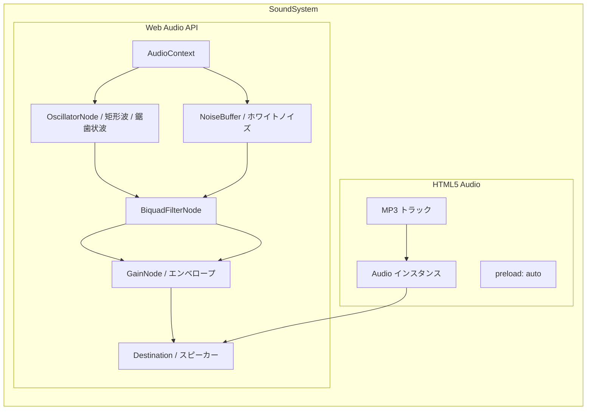

# 『幕末風雲録：双極の蒼穹』 システム設計書 (System Design Document)

本書は、一人用デッキ構築型ローグライトカードゲーム『幕末風雲録：双極の蒼穹 - Rogue Deck-Build -』の全体アーキテクチャ、データ構造、サブシステム仕様、および画面遷移を定義した詳細設計書である。

---

## 目次

1. [システム概要・設計思想](#1-システム概要設計思想)
2. [全体アーキテクチャ・モジュール構成](#2-全体アーキテクチャモジュール構成)
3. [データ構造・モデル設計 (Data Layer)](#3-データ構造モデル設計-data-layer)
4. [コアサブシステム詳細設計 (System Layer)](#4-コアサブシステム詳細設計-system-layer)
   - [4.1 メインコントローラー・ステート管理 (`BakumatsuApp`)](#41-メインコントローラーステート管理-bakumatsuapp)
   - [4.2 戦闘システム (`BattleSystem`)](#42-戦闘システム-battlesystem)
   - [4.3 マップ進行システム (`MapSystem`)](#43-マップ進行システム-mapsystem)
   - [4.4 ショップ・休息システム (`ShopSystem`)](#44-ショップ休息システム-shopsystem)
   - [4.5 UI・描画システム (`UIManager` / `ParticleSystem`)](#45-ui描画システム-uimanager--particlesystem)
   - [4.6 サウンドシステム (`SoundSystem`)](#46-サウンドシステム-soundsystem)
5. [画面遷移・ライフサイクル仕様](#5-画面遷移ライフサイクル仕様)
6. [非機能要件・パフォーマンス・セキュリティ](#6-非機能要件パフォーマンスセキュリティ)
7. [拡張・開発ガイドライン](#7-拡張開発ガイドライン)

---

## 1. システム概要・設計思想

### 1.1 ゲームコンセプト
- **ジャンル**: 幕末歴史テーマ × 一人用ローグライト・デッキ構築カードゲーム（Slay the Spire / Balatro 系譜）
- **舞台**: 幕末・慶応期（1865年〜1868年以降）の日本
- **プレイヤー体験**:
  - プレイヤーは「🔴 薩長同盟（討幕派）」または「🔵 幕府・会津藩（佐幕派）」のいずれかを選択。
  - 基本技のみで構成された初期デッキ（10枚）で旅立ち、歴史事件を通じて実在の志士たち（全90名超）と出会い仲間に迎える。
  - 西洋兵器や列強借款の強力な恩恵と引き換えに上昇する「列強介入度（インペリアル・ゲージ）」を管理し、100%植民地化敗北を回避しながら3幕を踏破する。

### 1.2 アーキテクチャ設計原則
1. **完全ゼロ依存 (Zero Dependencies)**
   - 外部ライブラリ（React, Vue, jQuery等）やビルドツール（Webpack, Vite等）を一切使用せず、標準Web規格（HTML5, CSS3, ES6+ Vanilla JavaScript）のみで動作する。
   - `index.html` をブラウザで直接開くだけでローカルでもGitHub Pagesでも完全動作する。
2. **モジュール分割と疎結合**
   - 関心の分離（SoC）を徹底し、データ層 (`data.js`)、状態・進行層 (`app.js`, `map.js`)、戦闘エンジン (`battle.js`)、取引層 (`shop.js`)、描画層 (`ui.js`, `particles.js`)、音響層 (`audio.js`) を独立したクラスとして構成。
3. **ブラウザ標準APIの極限活用**
   - **Canvas 2D API**: 墨飛沫・居合斬撃・火花パーティクル、コネクトリンク光線のリアルタイム物理描画。
   - **Web Audio API**: 音声アセット不要で和太鼓・拍子木・抜刀音・鐘音等をリアルタイム波形合成。
   - **HTML5 Audio**: 専用テーマBGM（MP3）の先読み（プリロード）およびブラウザ自動再生制限（Autoplay Policy）対応。

---

## 2. 全体アーキテクチャ・モジュール構成

### 2.1 システム構成図



### 2.2 モジュール一覧と責務

| モジュール | ファイル名 | 主要クラス / オブジェクト | 責務・役割 |
|---|---|---|---|
| **マスターデータ** | `js/data.js` | `GAME_DATA` | 全カード（108枚）、レリック（7個）、敵（11体）、歴史事件（103件）、世論トレンド（3種）、志士コネクトリンク（177組）の完全定義。 |
| **メイン制御** | `js/app.js` | `BakumatsuApp` | ゲーム全体の統括。プレイヤー基本ステータス（HP・資金・陣営・デッキ・レリック・介入度）、画面遷移（Title/Map/Battle等）、Autoplay解除。 |
| **戦闘エンジン** | `js/battle.js` | `BattleSystem` | ターン制バトル進行、プレイヤーおよび敵のデッキ/手札管理、AI行動ルーチン、ダメージ・シールド計算、バフ・デバフ、コネクトリンク判定。 |
| **マップ進行** | `js/map.js` | `MapSystem` | 3幕構成の有向グラフノード自動生成、ルート分岐制御、進行可能ノード判定、第一幕の志士獲得確定イベント選出。 |
| **商人・休息** | `js/shop.js` | `ShopSystem` | 洋行商人（カード・レリック購入、列強借款、カード削除）および本陣休息（HP回復、条約交渉、カード破棄）のロジック。 |
| **UIレンダラー** | `js/ui.js` | `UIManager` | DOM要素の動的描画、カード要素生成、手札ホバー時の史実コンボ予測ガイドライン描画、敵の伏せ札＆3Dフリップ公開、レスポンシブメニュー。 |
| **エフェクト** | `js/particles.js` | `ParticleSystem` | Canvas 2D によるパーティクル描画。墨飛沫、斬撃軌跡、火花、連鎖墨文字、コネクトリンクの金色光線。 |
| **音響システム** | `js/audio.js` | `SoundSystem` | Web Audio API による和風プロシージャル効果音の波形合成、および MP3 楽曲（BGM）のプリロード・自動再生・単発/ループ制御。 |

---

## 3. データ構造・モデル設計 (Data Layer)

すべてのマスターデータは `js/data.js` 内の `GAME_DATA` オブジェクトに集約されている。

### 3.1 カード定義 (`GAME_DATA.cards`)
全108枚のカードが登録されている。

```typescript
interface CardData {
    id: string;               // 一意のカード識別子 (例: "ryoma_kaiwentai")
    name: string;             // 表示名 (例: "坂本龍馬：海援隊の采配")
    faction: "tobaku" | "sabaku" | "neutral" | "curse"; // 陣営区分
    character?: string;       // 志士識別コード (コネクトリンク判定用, 例: "ryoma")
    type: "shishi" | "tactic" | "equip" | "curse";      // カード種別
    subType?: "leader" | "samurai" | "tactician" | "western";
    cost: number;             // 消費文（コスト）
    attack?: number;          // 基礎攻撃力
    shield?: number;          // 基礎防御力
    desc: string;             // カードテキスト
    rarity: "starter" | "common" | "uncommon" | "rare" | "legendary" | "curse";
    killedByTobaku?: boolean; // 歴史上討幕派により殺害/戦死/処刑（討幕派プレイ時入手不可）
    killedBySabaku?: boolean; // 歴史上佐幕派により殺害/討死/処刑（佐幕派プレイ時入手不可）
    onPlay?: (battle: BattleSystem, self: CardData) => void; // 特殊効果コールバック
}
```

#### 歴史的因縁による志士入手制限ルール（`canFactionAcquireCard`）
史実に忠実なゲームプレイを実現するため、敵対勢力の手によって殺害・処刑・討ち取られた志士は、仇敵側の陣営プレイ時には入手不可となる防護レイヤーを実装している。
- **討幕派プレイ時に入手不可な佐幕派志士（11名）**: 井伊直弼、近藤勇、小栗忠順、河井継之助、佐々木只三郎、甲賀源吾、土方歳三、伊庭八郎、原田左之助、野村左兵衛、原市之進
- **佐幕派プレイ時に入手不可な討幕派志士（9名）**: 吉田松陰、坂本龍馬、中岡慎太郎、久坂玄瑞、来島又兵衛、入江九一、吉田稔麿、望月亀弥太、真木和泉
- **制御レイヤー**:
  1. `GAME_DATA.canFactionAcquireCard(cardId, faction)`: 判定ヘルパー関数
  2. `BakumatsuApp.prototype.addCardToDeck(cardId)`: デッキ追加時のコアガード（仇敵陣営への加入を遮断）
  3. `UI.prototype.renderEvent(eventData)`: 歴史事件選択肢描画時に、獲得カードが相手陣営に討たれた志士である選択肢をフィルタ除外
  4. `BattleSystem.prototype.generateCardRewards()` / `ShopSystem.prototype.generateShopInventory()`: 戦闘報酬および商人販売リストの除外ガード

### 3.2 志士コネクト・リンク定義 (`GAME_DATA.combos`)
全177組に及ぶ史実コンボデータ。同一ターン内に手札から特定の志士群を使用することで成立。

```typescript
interface ShishiCombo {
    id: string;               // コンボ識別子 (例: "combo_ryoma_saigo")
    chars: string[];          // 必要志士コード配列 (例: ["ryoma", "saigo"])
    title: string;            // コンボ発動名 (例: "【龍馬と西郷・天下の大鐘！】")
    desc: string;             // 効果説明文
    apply: (battle: BattleSystem) => void; // コンボ発動時の追加ボーナス処理
}
```

### 3.3 歴史事件定義 (`GAME_DATA.events`)
全103件の歴史事件データ。幕ごとの時代設定（Act 1: 〜1864, Act 2: 1865〜1868春, Act 3: 1868夏〜明治）に適合して発生。各選択肢には `faction` 指定が付与され、陣営ごとに適切な歴史体験と志士獲得機会が提供される。

```typescript
interface EventChoice {
    text: string;             // 選択肢の表示名
    effectDesc: string;       // 選択時の結果概要
    faction?: "tobaku" | "sabaku"; // 選択肢の表示陣営限定
    canChoose?: (app: BakumatsuApp) => boolean; // 選択可能条件（資金等）
    action: (app: BakumatsuApp) => void; // 選択肢実行時の効果（カード獲得、HP変動、介入度変動等）
}

interface EventData {
    id: string;               // 事件識別子 (例: "ikeda_ya")
    title: string;            // 事件タイトル (例: "池田屋事件の急襲")
    act: 1 | 2 | 3;           // 発生対象幕
    desc: string;             // 事件の背景解説・導入テキスト
    choices: EventChoice[];   // プレイヤーが選べる選択肢（陣営フィルター適用後2〜4つ）
}
```

### 3.4 レリック（遺物）定義 (`GAME_DATA.relics`)
全7種の常時発動型・特殊パッシブ遺物。

```typescript
interface RelicData {
    id: string;               // 遺物識別子 (例: "kaientai_log")
    name: string;             // 遺物名 (例: "海援隊航海日誌")
    price: number;            // ショップ基本価格 (例: 160)
    desc: string;             // 効果説明
}
```

### 3.5 敵キャラクター定義 (`GAME_DATA.enemies`)
全11体の敵（雑魚、エリート、幕ボス）。

```typescript
interface EnemyIntent {
    type: "attack" | "defend" | "buff" | "debuff" | "western_attack" | "special";
    damage?: number;
    shield?: number;
    desc: string;
}

interface EnemyData {
    id: string;               // 敵識別子 (例: "kondo_isami")
    name: string;             // 敵表示名 (例: "近藤勇：新選組局長")
    maxHp: number;            // 最大体力
    isBoss?: boolean;         // ボスフラグ
    isElite?: boolean;        // エリートフラグ
    faction: "tobaku" | "sabaku"; // 所属陣営（プレイヤー陣営と対立）
    deck?: string[];          // 敵の所持デッキ（敵カードバトル用）
    intents: EnemyIntent[];   // 行動パターンサイクル
}
```

---

## 4. コアサブシステム詳細設計 (System Layer)

### 4.1 メインコントローラー・ステート管理 (`BakumatsuApp`)

#### 4.1.1 状態管理
`BakumatsuApp` はゲーム全体の中心ハブであり、以下の状態変数を保持する。
- `faction`: 選択陣営（`tobaku` / `sabaku`）
- `hp`, `maxHp`: プレイヤーHP（討幕派: 75, 佐幕派: 85）
- `gold`: プレイヤー所持金（討幕派: 100両, 佐幕派: 120両）
- `imperialGauge`: 列強介入度（0% 〜 100%）。100%到達時に即座に `handleGameOver`（植民地化敗北）を実行。
- `deck`: 現在の所持デッキ（カードIDの配列）
- `relics`: 現在所持しているレリックIDの配列
- `currentTrend`: 現在の幕で選ばれた世論トレンド

#### 4.1.2 画面遷移制御 (`switchScreen`)
画面コンテナ要素（`#screen-*`）の `active` クラスを制御し、画面に応じたヘッダー表示スタイルおよび BGM の自動切り替えを実行する。



#### 4.1.3 途中セーブ＆再開仕様（Auto-Save / Continue）
長時間のランでも安全に中断・再開できるよう、Webブラウザ標準の `localStorage`（キー: `bakumatsu_saved_run`）を利用した自動セーブ・ロード機構を搭載。
- **保存データ構成**:
  - `faction`: 選択陣営（`tobaku` / `sabaku`）
  - `hp`, `maxHp`, `gold`, `imperialGauge`: プレイヤー主ステータス
  - `deck`: 所持カードID配列
  - `relics`: 所持レリックID配列
  - `trendId`: 現在の幕の世論トレンド識別子
  - `map`: 幕（`currentAct`）、フロア（`currentFloor`）、現在地（`currentNodeId`）、全ノード状態（`completed` フラグ含む）、結線構造（`connections`）
  - `savedScene`: 保存時の画面状態（`map`, `battle`, `shop`, `rest`, `event`）
- **保存トリガー**:
  - ノード進入時（`MapSystem.prototype.visitNode`）
  - 戦闘勝利後のマップ帰還時（`BakumatsuApp.prototype.returnToMap`）
  - 歴史事件選択後のマップ帰還時
  - 洋行商人・本陣休息の利用および退出時
  - 次幕への進行時（`MapSystem.prototype.onActCompleted`）
- **消去トリガー**:
  - ゲームオーバー時（HP 0 または 列強介入度100%到達）
  - ゲームクリア時（終幕最終ボス撃破）
- **データ保護・UX**:
  - タイトル画面表示時にセーブデータの存在を自動判定し、データが存在する場合は「📜 続きから再開」ボタンと進行状況（陣営・幕・階層・体力・資金）を表示。
  - セーブデータが存在する状態で「新規出陣」を選択した場合は、確認ダイアログを表示して誤操作によるデータ消失を防止。

---

### 4.2 戦闘システム (`BattleSystem`)

#### 4.2.1 戦闘サイクルとデッキ管理
戦闘中は独立した4つのカードスタックを管理する。
1. **山札 (`drawPile`)**: 初期は所持デッキをシャッフルした状態。
2. **手札 (`hand`)**: ターン開始時に通常5枚（レリック補正あり）ドロー。上限10枚。
3. **捨札 (`discardPile`)**: 使用済みカードやターン終了時に破棄されたカード。山札枯渇時に再シャッフル。
4. **除外札 (`exhaustPile`)**: 戦闘中再使用不可のカード。

#### 4.2.2 敵側カードバトル（伏せ札 & 3Dフリップ公開）
敵武士も専用の山札・手札・捨札を保持する。
- プレイヤー手番中、敵のカードは和風金箔家紋の「伏せ札」として画面上部に提示される。
- 敵手番開始時、使用するカードが中央へ進出し、CSS 3D Transform により**表向きに反転（フリップ公開）**。技名・威力がアナウンスされてからダメージやバフが適用される。

#### 4.2.3 コネクトリンク（史実連携）発動フロー


---

### 4.3 マップ進行システム (`MapSystem`)

#### 4.3.1 3幕構成ステージ設計
- **第一幕（京洛動乱）**: 5フロア ＋ 近藤勇 / 桂小五郎
  - **特異仕様**: Floor 0（開始地点）は**志士を獲得できる歴史事件が確定で3分岐出現**。
- **第二幕（東海道進撃）**: 5フロア ＋ 松平容保 / 西郷隆盛
  - 開始地点は戦場。中盤に商人・エリート・休息が分岐配置。
- **終幕（天下分け目の決戦）**: 4フロア ＋ 徳川慶喜 / 新政府官軍
  - 決戦に向けた高難度ノード網。

#### 4.3.2 グラフ生成アルゴリズム
1. フロアごとに 2〜3 個のノードをランダム生成（`col` 座標 0, 1, 2）。
2. 隣接フロア間（$Floor_n \to Floor_{n+1}$）のノード同士を、$\Delta col \le 1$ の制約下で有向エッジ（結線）として連結。
3. 孤立ノードが発生しないよう、到達経路・出線数を保証。
4. ノード間の接続線は SVG 要素（`<line>`）として画面サイズに応じて動的レンダリング。

---

### 4.4 ショップ・休息システム (`ShopSystem`)

#### 4.4.1 洋行商人（国内調達 & 列強密貿易）
- **通常カード販売**: 陣営カードおよび中立カードから3〜4枚選出（レア度に応じた価格設定）。
- **レリック販売**: 未所持レリックから1〜2個選出。
- **列強密貿易（借款）**:
  - 【即座に 150両 獲得】 $\leftrightarrow$ 【列強介入度 +15% ＆ 不平等条約呪いカードがデッキ混入】
- **カード削除**: 初回75両（利用ごとに値上がり）。不要な初期カードや呪いを圧縮可能。

#### 4.4.2 本陣休息
休息マスでは1回のみ以下のいずれかのアクションを選択：
1. **茶を喫して養生 (HP回復)**: 最大HPの 30% を回復。
2. **条約再交渉 (列強介入度低下)**: 列強介入度を 10% 低下させる。
3. **軍律の引き締め (カード破棄)**: デッキから任意のカードを1枚完全に削除する。

---

### 4.5 UI・描画システム (`UIManager` / `ParticleSystem`)

#### 4.5.1 UI構造・レスポンシブ設計
- **画面解像度対応**: デスクトップからタブレット、狭小幅スマートフォンまで対応。
- **ヘッダー折りたたみプルダウンメニュー**:
  - 画面幅が狭い場合、ヘッダーに配置された「🎵 BGM」「🔊 効果音」「📜 帖（山札確認）」の各ボタンが自動的に「☰ メニュー」アイコンのプルダウン内に格納される。
  - 初期画面（タイトル）では全幅を保ち、マップ画面以降で適用。

#### 4.5.2 Canvasパーティクル描画 (`ParticleSystem`)
全画面背景の `<canvas id="fx-canvas">` 上で `requestAnimationFrame` による高速ループ描画を実行。
- **墨飛沫 (`createInkSplash`)**: 和風毛筆の滲みと飛沫を表現する物理パーティクル。
- **斬撃光 (`createSlash`)**: 居合・刀剣攻撃時に走る白銀と紅の閃光ライン。
- **浮遊墨文字 (`createFloatingText`)**: ダメージ数値、会心撃、「壱之連」「弐之連」、史実コンボ名のフロート表示。
- **コネクトリンク光線 (`drawLinkRays`)**: 手札ホバー時にカード中心座標間を結ぶ金色のエネルギー波形。

---

### 4.6 サウンドシステム (`SoundSystem`)

#### 4.6.1 ハイブリッド音響構成



#### 4.6.2 BGMトラックと再生仕様

| シーン | ファイル名 | ループ仕様 | 説明 |
|---|---|---|---|
| **初期画面** | `bgm/The_Iron_Horizon.mp3` | **非ループ（単発再生）** | 起動時に事前ロードされ最速再生。曲が終わると自動停止。 |
| **マップ・各画面** | `bgm/Edge_of_the_Setting_Sun.mp3` | ループ再生 | 街道・探索・商人・休息・歴史事件で継続再生。 |
| **戦闘画面** | `bgm/Thunder_of_the_Shogunate.mp3` | ループ再生 | 戦闘画面遷移で再生、決着時に自動停止。 |
| **ゲームクリア** | `bgm/Still_Water_at_the_Temple_Gate.mp3` | **非ループ（単発再生）** | 終幕ボス撃破時に再生。曲が終わると自動停止。 |

#### 4.6.3 ブラウザ自動再生（Autoplay）ポリシー対応
- ブラウザの「ユーザー操作なしでの音声再生禁止ポリシー」に対応するため、初期画面表示時に一度再生を試み、ブロックされた場合は画面内のあらゆる初回ジェスチャー（`click`, `pointerdown`, `touchstart`, `keydown`）を検知して `AudioContext.resume()` および `bgmAudio.play()` を透過的に起動する。

---

## 5. 画面遷移・ライフサイクル仕様

### 5.1 画面ID一覧
- `screen-title`: タイトル＆陣営選択画面
- `screen-map`: 3幕分岐マップ進行画面
- `screen-battle`: 対面カード戦闘画面
- `screen-event`: 歴史事件モーダル・選択画面
- `screen-shop`: 洋行商人画面
- `screen-rest`: 本陣休息画面
- `screen-gameover`: 敗北画面（戦死または植民地化）
- `screen-gamewin`: ゲームクリア画面（幕府再興または明治維新達成）

### 5.2 モーダル一覧
- `deck-modal`: 現在のデッキ一覧・除外カード閲覧
- `removal-modal`: カード破棄・削除選択画面
- `reward-modal`: 戦闘勝利報酬（資金・カード獲得）

---

## 6. 非機能要件・パフォーマンス・セキュリティ

1. **メモリリーク防止**:
   - `ParticleSystem` はパーティクルの寿命（`life <= 0`）を監視し、配列から厳格に除去。
   - 画面遷移時には前のBGMインスタンスを `pause()` して `currentTime = 0` でリセットし、重複再生・メモリ保持を防止。
2. **描画パフォーマンス**:
   - Canvas の再描画は `requestAnimationFrame` に同期し、60fps を安定維持。
   - SVG 接続線はリサイズ時およびノード移動時のみ再計算し、DOM操作コストを最小化。
3. **オフライン・セキュリティ**:
   - 外部 CDN や外部スクリプトを一切ロードしないため、XSSのリスクを極小化し、完全オフライン環境（ローカル実行）でも完全動作を保証。

---

## 7. 拡張・開発ガイドライン

### 7.1 新規カードの追加手順
1. `js/data.js` の `GAME_DATA.cards` に新しいカードオブジェクトを定義する。
2. 志士カードの場合は `character` 属性（英数字ID）を必ず付与する。
3. `CARDS.md` の一覧に追記する。

### 7.2 新規志士コネクト・リンクの追加手順
1. `js/data.js` の `GAME_DATA.combos` に新しいコンボオブジェクトを追加する。
2. `chars` 配列に対象志士の `character` コードを指定する。
3. 発動効果を `apply: (b) => { ... }` 内に実装する。

### 7.3 新規歴史事件の追加手順
1. `js/data.js` の `GAME_DATA.events` に事件オブジェクトを追加する。
2. 史実発生年 `eraYear` と対象幕 `act` を設定する。
3. 選択肢 `choices` にて関係する志士カードの獲得処理（`app.addCardToDeck(...)`）を実装する。
4. `EVENTS.md` の一覧に追記する。

---
*初版策定: 2026年9月*
*著作権表示: © 2026 rinevo / 幕末風雲録：双極の蒼穹 開発プロジェクト*
