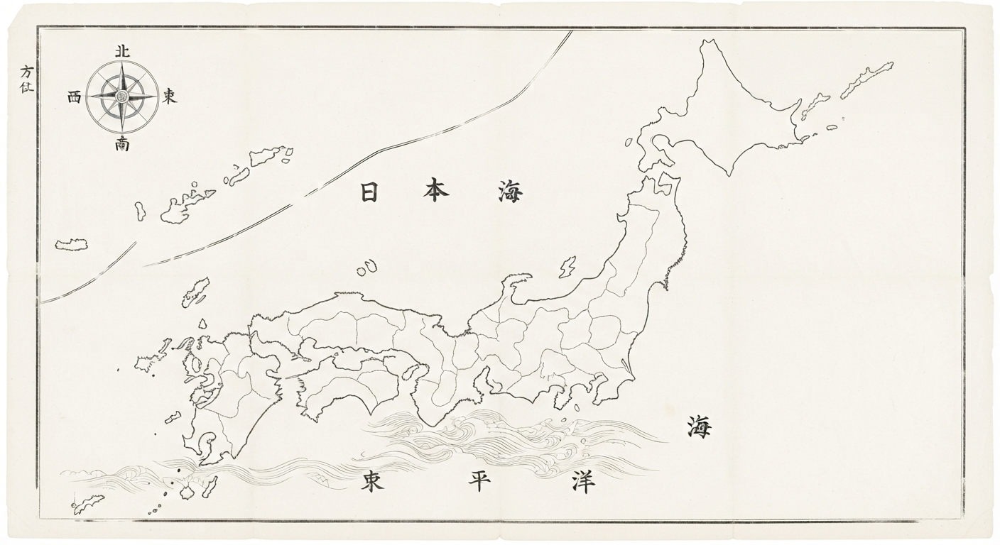
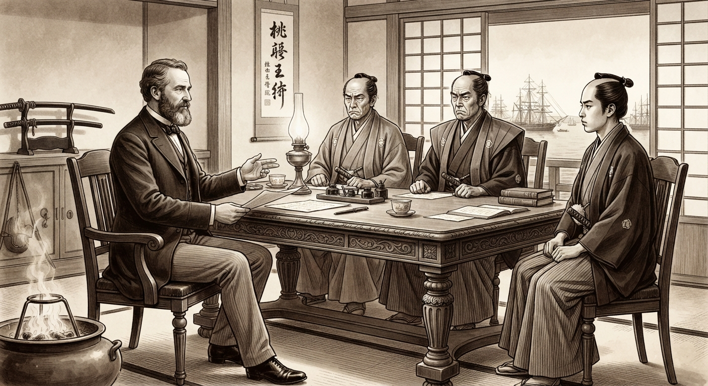
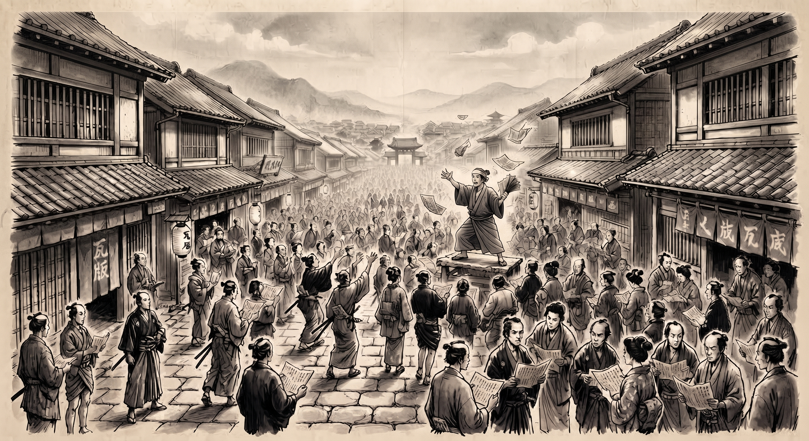

# 幕末風雲録：双極の蒼穹
## — Rogue Deck-Build —

<p align="center">
  
</p>

<p align="center">
  <strong>慶応の空は血煙と硝煙に染まる——</strong><br>
  東洋の孤島に迫る欧米列強の黒船の影。<br>
  天下を覆す志士となるか、幕威を貫く武士となるか。
</p>

<p align="center">
  
  
  
  
  
  
  
</p>

---

## 📖 概要

**幕末風雲録：双極の蒼穹** は、慶応の日本を舞台にした **一人用デッキ構築型ローグライトカードゲーム** です。

『Slay the Spire』や『Balatro』のようなテンポの良いカードバトルに、幕末史の歴史的ジレンマを融合。1ランが約30〜60分で完結し、繰り返しプレイするたびに異なる体験が生まれます。

> **外部ライブラリ・プラグイン不要。** `index.html` をブラウザで開くだけで即プレイ可能です。

---

## 🎮 ゲームの特徴

### ⚔️ 2大陣営の選択
| | 🔴 薩長同盟（討幕派） | 🔵 幕府・会津藩（佐幕派） |
|---|---|---|
| **初期HP** | 75 | 85 |
| **初期資金** | 100 両 | 120 両 |
| **初期デッキ** | 基本カード10枚（示現流×4、見切り×4、龍馬×1、密約×1） | 基本カード10枚（天然理心流×4、鉄壁×4、土方×1、局中法度×1） |
| **プレイスタイル** | 攻撃・連鎖・コンボ | 防御・持久・反撃 |
| **代表志士** | 坂本龍馬・西郷隆盛・桂小五郎・高杉晋作 | 土方歳三・近藤勇・沖田総司・勝海舟 |
| **リスク** | 西洋借款による列強介入の急加速 | 家臣の寝返り（呪いカード混入） |

> **※アンロック/報酬カードについて**：ゲーム開始時の初期デッキにはスターターカードのみが含まれ、強力な志士や戦術カードは戦闘勝利の報酬や商人からの購入によってデッキへ獲得していきます。

### ⚠️ 列強介入メーター（インペリアル・ゲージ）
- 西洋兵器の使用・列強密貿易（借款）によって **0% → 100%** へ上昇
- **100%に達すると「植民地化敗北」** — 戦闘状況に関わらず即ゲームオーバー
- 休息マスの「条約交渉」や特定イベント、一部志士カードで低下可能

### 🃏 多彩なカードと戦略
- **全108枚**のカード（討幕派50枚、佐幕派50枚、西洋兵器4枚、不平等条約呪い4枚）
- カードのレアリティ: Starter / Common / Uncommon / Rare / Legendary / Curse
- **全志士 史実コネクト・リンク (全81組・全志士網羅)**: すべての志士（全90名）に固有の史実コンボが存在。龍馬＋桂【薩長盟友！】、近藤＋土方【誠の連帯！】、西郷＋大久保【薩摩の両雄！】、松陰と弟子たち【松下村塾・至誠天動！】、松門四天王【松下村塾・松門四天王！】など、同一ターンに盟友を使用すると金色の絆が結ばれ、**専用の連鎖墨文字**とダイナミックな演出とともに強力なボーナス効果が発動
- **手札ホバー予測ガイドライン**: 手札の志士にカーソルを合わせると、コンボ対象となる手札のカードが金色に輝き、光線で結ばれて連携可能かを直感的に把握可能

### ✨ エフェクトと演出
- **連鎖カウンター**: カードを連続使用すると「壱之連」「弐之連」「参之連」…と墨文字と飛沫がダイナミックに出現
- **墨飛沫・斬撃・火花エフェクト**: HTML5 Canvas によるリアルタイムパーティクル描画
- **Web Audio APIサウンド**: 外部音声ファイル不要。和太鼓・拍子木・居合斬撃・小銃発砲・呪詛警報などをリアルタイム合成

### 🗾 ローグライト・マップ
**3幕構成**の分岐マップを踏破:

| 幕 | 舞台 | 最終ボス（討幕派） | 最終ボス（佐幕派） |
|---|---|---|---|
| 第一幕 | 京洛動乱（京都・伏見） | 近藤勇 | 桂小五郎 |
| 第二幕 | 東海道進撃（箱根） | 松平容保 | 西郷隆盛 |
| 終幕 | 天下分け目の決戦 | 徳川慶喜 | 新政府官軍 |

**ノード種別**:
- ⚔️ 戦場（通常敵）
- 👹 強敵（岡田以蔵・芹沢鴨など）
- 📜 歴史事件（池田屋事件・寺田屋遭難・大政奉還など）
- 💰 洋行商人（国内調達・列強密貿易/借款）
- 🍵 本陣休息（HP回復・条約交渉・カード削除）
- 🏯 決戦大陣（ボス戦）

### 📜 歴史的分岐イベント (全89件・年代別グループ化＆関係志士カード獲得対応)

> 📜 **全89件の歴史事件の詳細概要・各選択肢・獲得志士カード・陣営限定条件の完全一覧は [EVENTS.md (全歴史事件一覧)](./EVENTS.md) をご覧ください。**

- **年代別グループ化（3幕連動）**: 歴史事件は実際の史実発生年代順にグループ化され、各幕の舞台・時代背景に応じた歴史事件が発生します。
  - **第一幕：京洛動乱期（〜1864年・元治元年） [31件]**: 黒船来航、日米和親/修好通商条約、安政の大獄、桜田門外の変、生麦事件、新選組結成、薩英戦争、八月十八日の政変、池田屋事件、禁門の変、第一次長州征討など
  - **第二幕：東海道進撃期（1865年〜1868年春・慶応年間） [18件]**: 薩長同盟、伏見・寺田屋遭難、大政奉還、王政復古、鳥羽・伏見の戦端、五箇条の御誓文、江戸城無血開城、箱根山崎の激闘（伊庭八郎）など
  - **終幕：天下分け目の決戦〜明治期（1868年夏以降〜明治時代） [40件]**: 長岡城攻防、会津戦争・白虎隊、箱館政権・五稜郭・箱館総攻撃、東京遷都、版籍奉還、廃藩置県、岩倉使節団、鉄道開通、征韓論・明治六年政変、廃刀令、西南戦争、文明開化、自由民権運動など
- **史実関係志士のカード獲得**: 全89件の歴史事件すべてにおいて、その事件に史実で関与した志士が存在する場合、選択肢によって関係する志士カード（全96種）をデッキへ獲得可能。
  - **池田屋事件の急襲**: 突入で『近藤勇』、裏手捕縛で『沖田総司』、情報持ち帰りで『望月亀弥太』を獲得
  - **伏見・寺田屋の遭難**: 応戦で『坂本龍馬』、裏庭脱出で『吉井友実』を獲得
  - **大政奉還の歴史的評議**: 平和的移行で『後藤象二郎』、決戦主張で『岩倉具視』を獲得
  - **桜田門外の変・雪中の襲撃**: 襲撃加勢で『有馬新七』、警護で『井伊直弼』、離脱で『田中光顕』を獲得
  - **五稜郭、北辺の決断**: 抗戦で『榎本武揚』、武装解除で『大鳥圭介』、交渉で『島田魁』を獲得
  - **禁門の変、御所前の激戦**: 突撃で『久坂玄瑞』、民衆避難で『来島又兵衛』、殿軍で『入江九一』を獲得
  - **安政の大獄、弾圧の影**: 同志救出で『吉田松陰』、秩序維持で『井伊直弼』、逃亡路確保で『品川弥二郎』を獲得
  - **西南戦争、士族の決起**: 決起で『中村半次郎』、鎮圧軍で『山県有朋』、避難支援で『西郷隆盛』を獲得
  - **神戸海軍操練所**: 勝海舟の開国論に共鳴し『勝海舟』『坂本龍馬』『中岡慎太郎』を仲間に
  - **江戸城無血開城の談判**: 勝海舟と西郷隆盛の会談。『西郷隆盛』『勝海舟』『山岡鉄舟』『高橋泥舟』を獲得可能
  - **箱根山崎の激闘、隻腕の小天狗**: 伊庭八郎率いる遊撃隊と遭遇。佐幕派・討幕派それぞれの手法で『伊庭八郎：片腕の剣客』を獲得可能
  - **その他、全89イベントで史実に即した多彩な志士たちと邂逅・登用が可能！**

---

## 📂 ファイル構成

```
📁 幕末風雲録/
│
├── 📄 index.html          # メインHTML（全画面・モーダル・Canvasを一元管理）
├── 📄 CARDS.md             # 全カード一覧（全108枚完全掲載・効果＆連携データ）
├── 📄 EVENTS.md            # 全歴史事件一覧（全89件完全掲載・年代＆選択肢データ）
├── 📁 css/
│   └── 📄 style.css       # 和モダン×浮世絵風ダークファンタジー スタイル
├── 📁 js/
│   ├── 📄 audio.js        # Web Audio API プロシージャルサウンドエンジン
│   ├── 📄 particles.js    # Canvas パーティクル・エフェクト（墨飛沫・斬撃・コネクトリンク）
│   ├── 📄 data.js         # カード(全108種)・レリック・敵・歴史イベント・世論 マスターデータ
│   ├── 📄 battle.js       # 戦闘エンジン（ターン進行・AI・連鎖・ダメージ計算）
│   ├── 📄 map.js          # 3幕構成 分岐マップ生成＆進行エンジン
│   ├── 📄 shop.js         # 商人（国内調達・列強密貿易/借款）＆休息システム
│   ├── 📄 ui.js           # UI描画・カードレンダラー・予測ガイドライン・モーダル
│   └── 📄 app.js          # メインコントローラー・ステート管理・ゲームループ
└── 📁 img/
    ├── 🖼️ nippon.jpg      # マップ背景（水墨画風日本地図）
    ├── 🖼️ tatakai.jpg     # 戦闘画面背景
    ├── 🖼️ shop.jpg        # 商人画面背景
    ├── 🖼️ event.jpg       # 歴史事件画面背景
    ├── 🖼️ rest.jpg        # 休息画面背景
    ├── 🖼️ gameover.jpg    # ゲームオーバー画面背景
    └── 🖼️ gamewin.jpg     # ゲームクリア画面背景
```

---

## 🚀 プレイ方法

### 必要なもの
- モダンブラウザ（Chrome / Edge / Firefox / Safari 最新版推奨）
- サーバー不要・インストール不要

### 起動手順

```bash
# リポジトリをクローン
git clone https://github.com/rinevo/Bakumatsu.git

# index.html をブラウザで開く（ダブルクリックでも可）
```
または [GitHub Pages](https://rinevo.github.io/Bakumatsu/) でそのままプレイ。

### 操作方法
| 操作 | 内容 |
|---|---|
| カードをクリック | カードをプレイ（文を消費） |
| カードをホバー | コネクト・リンク予測ガイドラインを表示 |
| 「太刀を収める」ボタン | ターン終了（敵の行動へ） |
| マップノードをクリック | 選択可能なマスへ移動 |
| 「📜 帖（山札確認）」ボタン | 現在のデッキを確認 |
| 「🔊 音声: 鳴」ボタン | サウンドのオン/オフ切り替え |

---

## 🃏 代表カードギャラリー

> 📖 **全108枚の完全なカード一覧・詳細効果・全81組の史実コネクトリンク（コンボ）は [CARDS.md (全カードギャラリー)](./CARDS.md) をご覧ください。**

### 🔴 討幕派（薩長同盟）代表カード

| カード名 | 種類 | コスト | 攻撃 | 防御 | レアリティ | 代表的なコンボ（連携） | 効果 |
|---|---|---|---|---|---|---|---|
| 坂本龍馬：海援隊の采配 | 志士 | 2文 | 8 | 4 | Starter | 桂小五郎 【薩長盟友！】<br>勝海舟 【海舟と龍馬！】<br>武市半平太＆中岡慎太郎 【土佐三傑・維新天動！】 | 敵に 8 ダメージ、防 4。手札を全て捨てて3枚ドロー。敵の攻撃意図を3減少。 |
| 桂小五郎：神道無念流 | 志士 | 1文 | 8 | 4 | Common | 坂本龍馬 【薩長盟友！】<br>木戸孝允 【維新の設計図！】 | 敵に 8 ダメージ、防 4。【連携：坂本龍馬】場に龍馬がいればコスト0＆追加1ドロー。 |
| 西郷隆盛：薩摩の巨魁 | 志士 | 2文 | 16 | 6 | Rare | 大久保利通 【薩摩の両雄！】<br>中村半次郎 【薩摩示現の剛勇！】 | 敵に 16 ダメージ。敵のシールドを半減させる。 |
| 高杉晋作：奇兵隊の突進 | 志士 | 2文 | 10 | - | Uncommon | 久坂玄瑞＆吉田稔麿＆入江九一 【松下村塾・松門四天王！】<br>吉田松陰＆久坂玄瑞 【松下村塾・至誠天動！】 | 敵に 10 ダメージ。このターン使ったカード1枚につき追加3ダメージ。 |
| 吉田松陰：松下村塾の志 | 志士 | 1文 | 7 | 7 | Rare | 高杉晋作＆久坂玄瑞 【松下村塾・至誠天動！】<br>山田顕義 / 伊藤博文 / 山県有朋 など | 敵に 7 ダメージ、防 7。カードを1枚引く。 |
| 大久保利通：冷徹な謀略 | 戦術 | 1文 | - | 8 | Uncommon | 西郷隆盛 【薩摩の両雄！】 | 防 8。敵に「脱力 2」（与ダメ25%減）を付与し、カードを1枚引く。 |
| 中岡慎太郎：盟友の奔走 | 志士 | 1文 | 7 | 6 | Rare | 坂本龍馬 【土佐の盟友！】<br>武市半平太 【土佐勤王の義盟！】 | 敵に 7 ダメージ、防 6。手札を1枚引く。 |

### 🔵 佐幕派（幕府・会津藩）代表カード

| カード名 | 種類 | コスト | 攻撃 | 防御 | レアリティ | 代表的なコンボ（連携） | 効果 |
|---|---|---|---|---|---|---|---|
| 土方歳三：鬼の副長 | 志士 | 2文 | 13 | 7 | Starter | 近藤勇 【誠の連帯！】<br>近藤勇＆沖田総司 【誠の結び・試衛館三傑！】 | 敵のシールドを無視して 13 ダメージ、防 7。【代償】ターン終了時に手札を1枚破棄。 |
| 近藤勇：虎徹の一撃 | 志士 | 2文 | 12 | 8 | Common | 土方歳三 【誠の連帯！】<br>土方歳三＆沖田総司 【誠の結び・試衛館三傑！】 | 敵に 12 ダメージ、防 8。【連携：土方歳三】場に土方がいれば反撃態勢（10反射）。 |
| 沖田総司：無双三段突き | 志士 | 2文 | 6 | - | Rare | 斎藤一 【一番隊の双刃！】<br>近藤勇＆土方歳三 【誠の結び・試衛館三傑！】 | 敵に 6 ダメージ × 3回。敵に「流血 3」（ターン毎ダメージ）を付与。 |
| 勝海舟：無血の大局観 | 戦術 | 2文 | - | 16 | Rare | 坂本龍馬 【海舟と龍馬！】<br>永井尚志 【幕臣海防の先見！】 | 防 16。列強介入メーターを 5% 下げる。敵の次の攻撃力を半減。 |
| 松平容保：会津の義気 | 志士 | 2文 | - | 15 | Uncommon | 山川浩 【会津守護の陣！】<br>松平定敬 【一会桑の絆！】 | 防 15。現在のシールド値を 1.4 倍にする。 |
| 斎藤一：無外流の牙突 | 志士 | 1文 | 9 | 3 | Common | 沖田総司 【一番隊の双刃！】<br>伊東甲子太郎 【御陵衛士の暗躍！】 | 敵に 9 ダメージ。敵が攻撃準備中なら威力 1.5倍（13）。 |
| 伊庭八郎：片腕の剣客 | 志士 | 2文 | 15 | 6 | Rare | 林忠崇 【遊撃脱藩の武士道！】<br>人見勝太郎 【遊撃隊の義盟！】 | 敵に 15 ダメージ、防 6。敵が攻撃意図なら追加5ダメージ。 |

### ⚡ 西洋兵器・列強カード（中立代表）

| カード名 | 種類 | コスト | 攻撃 | 防御 | レアリティ | 効果 |
|---|---|---|---|---|---|---|
| 新式ミニエ銃 | 装備 | 1文 | - | - | Uncommon | 【西洋火器】この戦闘中、全攻撃カード威力+4。⚠️ 列強介入メーター+3%。 |
| アームストロング砲 | 戦術 | 2文 | 22 | - | Rare | 敵に 22 の破滅的ダメージ。敵のシールドを全破壊。⚠️ 列強介入メーター+5%。 |

### ⚠️ 不平等条約・呪いカード（代表）

| カード名 | 種類 | コスト | 攻撃 | 防御 | レアリティ | 効果 |
|---|---|---|---|---|---|---|
| 不平等条約：治外法権の受容 | 呪い | 0文 | - | - | Curse | 【呪い・プレイ不可】手札にある間、ターン終了時に HP 3 ダメージ ＆ 列強介入+4%。 |
| 不平等条約：関税自主権喪失 | 呪い | 0文 | - | - | Curse | 【呪い・プレイ不可】手札にある間、他の全カードのコストが+1文される。 |

> 📜 **全50名の討幕派志士、全50名の佐幕派武士を含む全108枚の完全データは [CARDS.md](./CARDS.md) にてご確認いただけます。**

---

## 🏮 レリック（遺物）

| 遺物名 | 価格 | 効果 |
|---|---|---|
| 錦の御旗 | 180両 | 戦闘開始時、全ての敵に「脱力 2」（与ダメ25%減）を付与する。 |
| 西洋懐中時計 | 200両 | 各戦闘の第1ターン、追加で 1文 を得てカードを2枚余分に引く。 |
| 海援隊航海日誌 | 160両 | 1ターン中にカードを4枚使用するたびに、1文を回復する。 |
| 新選組の浅葱羽織 | 150両 | シールドを獲得するカードを使うたび、追加で+3シールドを得る。 |
| 古銭・和同開珎 | 140両 | 獲得両（ゴールド）が常時 20% 増加する。 |
| 蘭方医の手術道具 | 170両 | 各戦闘勝利時、HPを 6 回復する。 |
| 尊皇不抜の建白書 | 210両 | 列強介入メーターの上昇量を常時 25% 抑制する。 |

---

## 🔊 サウンドシステム

外部音声ファイルを一切使用せず、**Web Audio API** でリアルタイムに和風サウンドを合成します。

| サウンド | 発動タイミング |
|---|---|
| 和太鼓（ドン！） | ターン開始・デッキシャッフル・ボス強化行動 |
| 拍子木（カンッ！） | 連鎖カウンター・休息マス |
| 居合抜刀（シャキーン！） | 通常攻撃カード使用 |
| 重撃（ズバッ！） | 貫通攻撃・必殺技 |
| 小銃・大砲（ズドン！） | 西洋兵器カード使用 |
| 鉄壁（カキィン！） | シールド獲得 |
| 黄金の鐘音（コロコロ） | コネクト・リンク発動 |
| 重低音警報（ゴォォ…） | 呪いカード・列強介入増加 |
| 琴の和音 | 勝利ファンファーレ |
| 貨幣音（チャリン） | 両（ゴールド）獲得 |

---

## 📸 背景画像

| 1. マップ画面 | 2. 戦闘画面 |
|:---:|:---:|
|  |  |

| 3. 承認（商人）画面 | 4. 歴史事件 |
|:---:|:---:|
|  |  |

---

## 🛠️ 技術スタック

| 技術 | 用途 |
|---|---|
| **Vanilla HTML5** | UI構造・全画面レイアウト・モーダル |
| **CSS3** | 和モダン×浮世絵風テーマ・アニメーション・レスポンシブ |
| **Vanilla JavaScript (ES6+)** | ゲームロジック・クラスベース設計 |
| **Web Audio API** | プロシージャルな和風サウンド合成 |
| **HTML5 Canvas (2D)** | パーティクルエフェクト・コネクトリンク光線描画 |
| **SVG** | マップノード間の接続線描画 |

> **外部フレームワーク・ライブラリ・ビルドツール不使用** — ピュアなWeb技術のみで構築。

---

## 🎯 今後の予定（ロードマップ）

- [ ] 追加カード・レリックの実装
- [ ] セーブデータ機能（localStorage）
- [ ] リーダーボード（クリアターン数・介入度）
- [ ] 追加キャラクター・陣営（長州ゲリラ陣営など）
- [ ] モバイル対応（タッチ操作最適化）
- [ ] BGM（Web Audio API でのループ生成改善）

---

## 📄 ライセンス

This project is licensed under the **MIT License** — see the [LICENSE](LICENSE) file for details.

---

## 🙏 クレジット

- **ゲームデザイン・プログラミング**: rinevo
- **企画・仕様**: 幕末歴史を題材としたオリジナル設計
- **使用技術**: Web Audio API, HTML5 Canvas, Vanilla JavaScript

---

<p align="center">
  <em>「世に生を得るは事を成すにあり」— 坂本龍馬</em>
</p>
