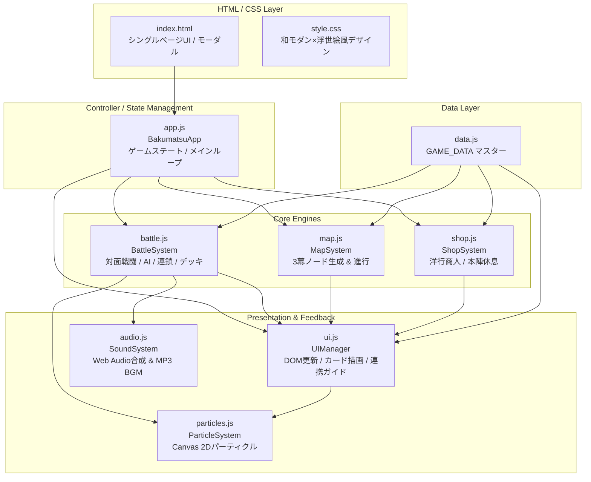
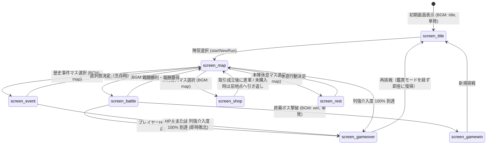
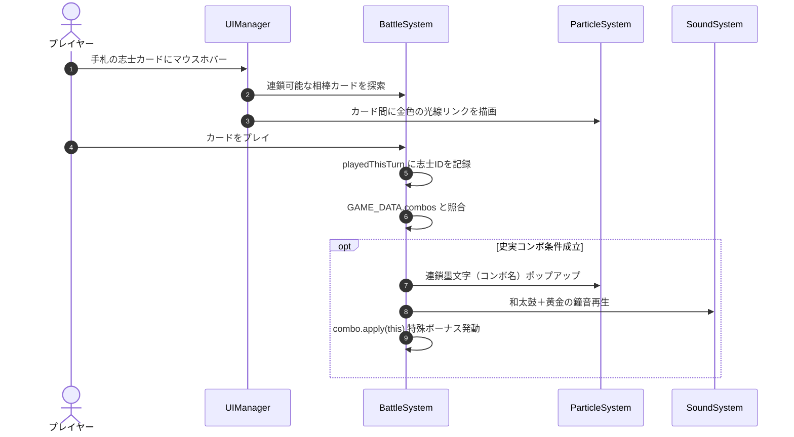
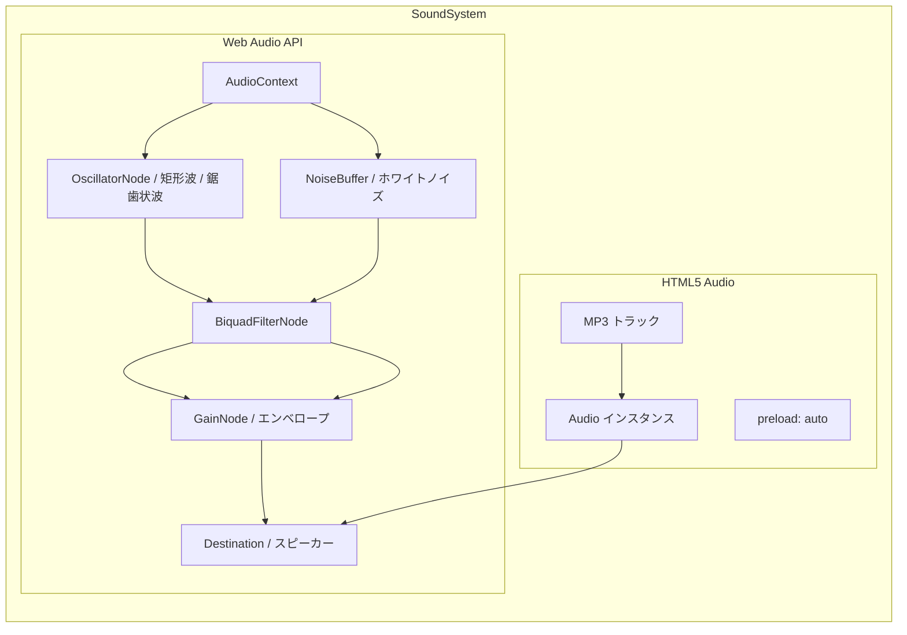

# 『幕末風雲録：双極の蒼穹』 システム設計書 (System Design Document)

本書は、一人用デッキ構築型ローグライトカードゲーム『幕末風雲録：双極の蒼穹 - Rogue Deck-Build -』の全体アーキテクチャ、データ構造、サブシステム仕様、および画面遷移を定義した詳細設計書である。

[← README（トップ）へ戻る](../README.md)

---

## 目次

1. [システム概要・設計思想](#1-システム概要設計思想)
2. [全体アーキテクチャ・モジュール構成](#2-全体アーキテクチャモジュール構成)
3. [データ構造・モデル設計 (Data Layer)](#3-データ構造モデル設計-data-layer)
4. [コアサブシステム詳細設計 (System Layer)](#4-コアサブシステム詳細設計-system-layer)
   - [4.1 メインコントローラー・ステート管理 (`BakumatsuApp`)](#41-メインコントローラーステート管理-bakumatsuapp)
   - [4.2 戦闘システム (`BattleSystem`)](#42-戦闘システム-battlesystem)
   - [4.3 マップ進行システム (`MapSystem`)](#43-マップ進行システム-mapsystem)
   - [4.4 ショップ・休息システム (`ShopSystem`)](#44-ショップ休息システム-shopsystem)
   - [4.5 UI・描画システム (`UIManager` / `ParticleSystem`)](#45-ui描画システム-uimanager--particlesystem)
   - [4.6 サウンドシステム (`SoundSystem`)](#46-サウンドシステム-soundsystem)
5. [画面遷移・ライフサイクル仕様](#5-画面遷移ライフサイクル仕様)
6. [非機能要件・パフォーマンス・セキュリティ](#6-非機能要件パフォーマンスセキュリティ)
7. [拡張・開発ガイドライン](#7-拡張開発ガイドライン)

---

## 1. システム概要・設計思想

### 1.1 ゲームコンセプト
- **ジャンル**: 幕末歴史テーマ × 一人用ローグライト・デッキ構築カードゲーム（Slay the Spire / Balatro 系譜）
- **舞台**: 幕末・慶応期（1865年〜1868年以降）の日本
- **プレイヤー体験**:
  - プレイヤーは「🔴 薩長同盟（討幕派）」または「🔵 幕府・会津藩（佐幕派）」のいずれかを選択。
  - 基本技のみで構成された初期デッキ（Starter攻撃1枚・防御1枚の計2枚）で旅立ち、歴史事件を通じて実在の志士たち（全90名超）と出会い仲間に迎える。
  - 西洋兵器や列強借款の強力な恩恵と引き換えに上昇する「列強介入度（インペリアル・ゲージ）」を管理し、100%植民地化敗北を回避しながら3幕を踏破する。

### 1.2 アーキテクチャ設計原則
1. **完全ゼロ依存 (Zero Dependencies)**
   - 外部ライブラリ（React, Vue, jQuery等）やビルドツール（Webpack, Vite等）を一切使用せず、標準Web規格（HTML5, CSS3, ES6+ Vanilla JavaScript）のみで動作する。
   - `index.html` をブラウザで直接開くだけでローカルでもGitHub Pagesでも完全動作する。
2. **モジュール分割と疎結合**
   - 関心の分離（SoC）を徹底し、データ層 (`data.js`)、状態・進行層 (`app.js`, `map.js`)、戦闘エンジン (`battle.js`)、取引層 (`shop.js`)、描画層 (`ui.js`, `particles.js`)、音響層 (`audio.js`) を独立したクラスとして構成。
3. **ブラウザ標準APIの極限活用**
   - **Canvas 2D API**: 墨飛沫・居合斬撃・火花パーティクル、コネクトリンク光線のリアルタイム物理描画。
   - **Web Audio API**: 音声アセット不要で和太鼓・拍子木・抜刀音・鐘音等をリアルタイム波形合成。
   - **HTML5 Audio**: 専用テーマBGM（MP3）の先読み（プリロード）およびブラウザ自動再生制限（Autoplay Policy）対応。

---

## 2. 全体アーキテクチャ・モジュール構成

### 2.1 システム構成図



### 2.2 モジュール一覧と責務

| モジュール | ファイル名 | 主要クラス / オブジェクト | 責務・役割 |
|---|---|---|---|
| **マスターデータ** | `js/data.js` | `GAME_DATA` | 全カード（116枚）、レリック（20個）、敵（24体）、歴史事件（109件）、世論トレンド（3種）、志士コネクトリンク（233組）の完全定義。 |
| **メイン制御** | `js/app.js` | `BakumatsuApp` | ゲーム全体の統括。プレイヤー基本ステータス（HP・資金・陣営・デッキ・レリック・介入度）、画面遷移（Title/Map/Battle等）、Autoplay解除。 |
| **戦闘エンジン** | `js/battle.js` | `BattleSystem` | ターン制バトル進行、プレイヤーおよび敵のデッキ/手札管理、AI行動ルーチン、ダメージ・シールド計算、バフ・デバフ、コネクトリンク判定。 |
| **マップ進行** | `js/map.js` | `MapSystem` | 3幕構成の有向グラフノード自動生成、ルート分岐制御、進行可能ノード判定、第一幕の志士獲得確定イベント選出。 |
| **商人・休息** | `js/shop.js` | `ShopSystem` | 洋行商人（カード・レリック購入、列強借款、カード削除）および本陣休息（HP回復、条約交渉、カード破棄）のロジック。 |
| **UIレンダラー** | `js/ui.js` | `UIManager` | DOM要素の動的描画、カード要素生成、手札ホバー時の史実コンボ予測ガイドライン描画、敵の伏せ札＆3Dフリップ公開、レスポンシブメニュー。 |
| **エフェクト** | `js/particles.js` | `ParticleSystem` | Canvas 2D によるパーティクル描画。墨飛沫、斬撃軌跡、火花、連鎖墨文字、コネクトリンクの金色光線。 |
| **音響システム** | `js/audio.js` | `SoundSystem` | Web Audio API による和風プロシージャル効果音の波形合成、および MP3 楽曲（BGM）のプリロード・自動再生・単発/ループ制御。 |

---

## 3. データ構造・モデル設計 (Data Layer)

すべてのマスターデータは `js/data.js` 内の `GAME_DATA` オブジェクトに集約されている。

### 3.1 カード定義 (`GAME_DATA.cards`)
全116枚のカードが登録されている。

```typescript
interface CardData {
    id: string;               // 一意のカード識別子 (例: "ryoma_kaiwentai")
    name: string;             // 表示名 (例: "坂本龍馬：海援隊の采配")
    faction: "tobaku" | "sabaku" | "neutral" | "curse"; // 陣営区分
    character?: string;       // 志士識別コード (コネクトリンク判定用, 例: "ryoma")
    type: "shishi" | "tactic" | "equip" | "curse";      // カード種別
    subType?: "leader" | "samurai" | "tactician" | "western";
    cost: number;             // 消費文（コスト）
    attack?: number;          // 基礎攻撃力
    shield?: number;          // 基礎防御力
    desc: string;             // カードテキスト
    rarity: "starter" | "common" | "uncommon" | "rare" | "legendary" | "curse";
    killedByTobaku?: boolean; // 歴史上討幕派により殺害/戦死/処刑（討幕派プレイ時入手不可）
    killedBySabaku?: boolean; // 歴史上佐幕派により殺害/討死/処刑（佐幕派プレイ時入手不可）
    onPlay?: (battle: BattleSystem, self: CardData) => void; // 特殊効果コールバック
}
```

#### 歴史的因縁による志士入手制限ルール（`canFactionAcquireCard`）
史実に忠実なゲームプレイを実現するため、敵対勢力の手によって殺害・処刑・討ち取られた志士は、仇敵側の陣営プレイ時には入手不可となる防護レイヤーを実装している。
- **討幕派プレイ時に入手不可な佐幕派志士（12名）**: 井伊直弼、近藤勇、小栗忠順、河井継之助、佐々木只三郎、甲賀源吾、土方歳三、伊庭八郎、原田左之助、野村左兵衛、原市之進、萱野権兵衛
- **佐幕派プレイ時に入手不可な討幕派志士（10名）**: 吉田松陰、坂本龍馬、中岡慎太郎、久坂玄瑞、来島又兵衛、入江九一、吉田稔麿、望月亀弥太、真木和泉、武田耕雲斎
- **制御レイヤー**:
  1. `GAME_DATA.canFactionAcquireCard(cardId, faction)`: 判定ヘルパー関数
  2. `BakumatsuApp.prototype.addCardToDeck(cardId)`: デッキ追加時のコアガード（仇敵陣営への加入を遮断）
  3. `UI.prototype.renderEvent(eventData)`: 歴史事件選択肢描画時に、獲得カードが相手陣営に討たれた志士である選択肢をフィルタ除外
  4. `BattleSystem.prototype.generateCardRewards()` / `ShopSystem.prototype.generateShopInventory()`: 戦闘報酬および商人販売リストの除外ガード

### 3.2 志士コネクト・リンク定義 (`GAME_DATA.combos`)
全233組に及ぶ史実コンボデータ。同一ターン内に手札から特定の志士群を使用することで成立。

```typescript
interface ShishiCombo {
    id: string;               // コンボ識別子 (例: "combo_ryoma_saigo")
    chars: string[];          // 必要志士コード配列 (例: ["ryoma", "saigo"])
    title: string;            // コンボ発動名 (例: "【龍馬と西郷・天下の大鐘！】")
    desc: string;             // 効果説明文
    apply: (battle: BattleSystem) => void; // コンボ発動時の追加ボーナス処理
}
```

### 3.3 歴史事件定義 (`GAME_DATA.events`)
全109件の歴史事件データ。幕ごとの時代設定（Act 1: 〜1864, Act 2: 1865〜1868春, Act 3: 1868夏〜明治）に適合して発生。各選択肢には `faction` 指定が付与され、陣営ごとに適切な歴史体験と志士獲得機会が提供される。

```typescript
interface EventChoice {
    text: string;             // 選択肢の表示名
    effectDesc: string;       // 選択時の結果概要
    faction?: "tobaku" | "sabaku"; // 選択肢の表示陣営限定
    canChoose?: (app: BakumatsuApp) => boolean; // 選択可能条件（資金等）
    action: (app: BakumatsuApp) => void; // 選択肢実行時の効果（カード獲得、HP変動、介入度変動等）
}

interface EventData {
    id: string;               // 事件識別子 (例: "ikeda_ya")
    title: string;            // 事件タイトル (例: "池田屋事件の急襲")
    act: 1 | 2 | 3;           // 発生対象幕
    importance: 1 | 2 | 3;    // 事件の重要度 (1: ★通常動乱, 2: ★★重大政変, 3: ★★★天下決戦・歴史転換点)
    desc: string;             // 事件の背景解説・導入テキスト
    choices: EventChoice[];   // プレイヤーが選べる選択肢（陣営フィルター適用後2〜4つ）
}
```

### 3.4 レリック（遺物）定義 (`GAME_DATA.relics`)
全20種の常時発動型・特殊パッシブ遺物（基本16種＋歴史の関門限定の神器レリック4種）。
- **関門限定神器レリック**:
  - `choshu_blood_pact`（長州の血盟録）: 毎ターン開始時、手札の全カードの文コスト-1。
  - `imperial_brocade_amulet`（禁裏の錦旗御守）: 毎ターン開始時、シールドを自動で 6 獲得。
  - `omura_tactics_scroll`（大村益次郎の陣図）: 戦闘開始時、敵全体に 20 ダメージを与え、脱力2を付与。
  - `aoi_crest_blade`（葵の御紋章佩刀）: 全攻撃カードの基礎威力を常時+5。戦闘開始時、シールド 12 獲得。

```typescript
interface RelicData {
    id: string;               // 遺物識別子 (例: "kaientai_log")
    name: string;             // 遺物名 (例: "海援隊航海日誌")
    price: number;            // ショップ基本価格 (例: 160)
    desc: string;             // 効果説明
    onBattleStart?: (battle: BattleSystem) => void;
    onTurnStart?: (battle: BattleSystem, turn: number) => void;
    onCardPlayed?: (battle: BattleSystem, card: CardData) => void;
    onBattleWin?: (app: BakumatsuApp) => void;
}
```

### 3.5 敵キャラクター定義 (`GAME_DATA.enemies`)
全24体の敵（各幕通常敵4体、強敵/エリート2体、幕ボス/最終ボス2体）。

```typescript
interface EnemyIntent {
    type: "attack" | "defend" | "buff" | "curse";
    damage?: number;
    shield?: number;
    times?: number;           // 連撃回数 (例: 2回攻撃, 3回攻撃)
    strength?: number;        // 剛力バフ増加量
    curseId?: string;         // デッキ混入呪詛ID
    desc: string;
}

interface EnemyData {
    name: string;             // 敵表示名 (例: "新選組局長・近藤勇")
    maxHp: number;            // 最大体力
    isBoss?: boolean;         // ボスフラグ
    isFinalBoss?: boolean;    // 最終ボスフラグ
    isElite?: boolean;        // エリートフラグ
    sprite: string;           // アバター識別名
    faction?: "tobaku" | "sabaku"; // 所属陣営（プレイヤー陣営と対立）
    intents: EnemyIntent[];   // 行動パターンサイクル
}
```

---

## 4. コアサブシステム詳細設計 (System Layer)

### 4.1 メインコントローラー・ステート管理 (`BakumatsuApp`)

#### 4.1.1 状態管理
`BakumatsuApp` はゲーム全体の中心ハブであり、以下の状態変数を保持する。
- `faction`: 選択陣営（`tobaku` / `sabaku`）
- `hp`, `maxHp`: プレイヤーHP（討幕派: 75, 佐幕派: 85）
- `gold`: プレイヤー所持金（討幕派: 100両, 佐幕派: 120両）
- `imperialGauge`: 列強介入度（0% 〜 100%）。100%到達時に即座に `handleGameOver`（植民地化敗北）を実行。
- `deck`: 現在の所持デッキ（カードIDの配列）
- `relics`: 現在所持しているレリックIDの配列
- `publicOpinion`: 世論メーター（-100% [佐幕極限] 〜 +100% [討幕極限]、初期値: -25% [佐幕優勢]）
- `currentTrend`: 現在の幕で選ばれた世論トレンド

#### 4.1.2 画面遷移制御 (`switchScreen`)
画面コンテナ要素（`#screen-*`）の `active` クラスを制御し、画面に応じたヘッダー表示スタイルおよび BGM の自動切り替えを実行する。



#### 4.1.3 途中セーブ＆再開仕様（Auto-Save / Continue）
長時間のランでも安全に中断・再開できるよう、Webブラウザ標準の `localStorage`（キー: `bakumatsu_saved_run`）を利用した自動セーブ・ロード機構を搭載。
- **保存データ構成**:
  - `faction`: 選択陣営（`tobaku` / `sabaku`）
  - `hp`, `maxHp`, `gold`, `imperialGauge`: プレイヤー主ステータス
  - `deck`: 所持カードID配列
  - `relics`: 所持レリックID配列
  - `trendId`: 現在の幕の世論トレンド識別子
  - `map`: 幕（`currentAct`）、フロア（`currentFloor`）、現在地（`currentNodeId`）、全ノード状態（`completed` フラグ含む）、結線構造（`connections`）
  - `savedScene`: 保存時の画面状態（`map`, `battle`, `shop`, `rest`, `event`）
- **保存トリガー**:
  - ノード進入時（`MapSystem.prototype.visitNode`）
  - 戦闘勝利後のマップ帰還時（`BakumatsuApp.prototype.returnToMap`）
  - 歴史事件選択後のマップ帰還時
  - 洋行商人・本陣休息の利用および退出時
  - 次幕への進行時（`MapSystem.prototype.onActCompleted`）
- **消去トリガー**:
  - ゲームオーバー時（HP 0 または 列強介入度100%到達）
  - ゲームクリア時（終幕最終ボス撃破）
- **データ保護・UX**:
  - タイトル画面表示時にセーブデータの存在を自動判定し、データが存在する場合は「📜 続きから再開」ボタンと進行状況（陣営・幕・階層・体力・資金）を表示。
  - セーブデータが存在する状態で「新規出陣」を選択した場合は、確認ダイアログを表示して誤操作によるデータ消失を防止。

---

### 4.2 戦闘システム (`BattleSystem`)

#### 4.2.1 戦闘サイクルとデッキ管理
戦闘中は独立した4つのカードスタックを管理する。
1. **山札 (`drawPile`)**: 初期は所持デッキをシャッフルした状態。
2. **手札 (`hand`)**: ターン開始時に通常5枚（レリック補正あり）ドロー。上限10枚。
3. **捨札 (`discardPile`)**: 使用済みカードやターン終了時に破棄されたカード。山札枯渇時に再シャッフル。
4. **除外札 (`exhaustPile`)**: 戦闘中再使用不可のカード。

#### 4.2.2 敵側カードバトル（伏せ札 & 3Dフリップ公開）
敵武士も専用の山札・手札・捨札を保持する。
- プレイヤー手番中、敵のカードは和風金箔家紋の「伏せ札」として画面上部に提示される。
- 敵手番開始時、使用するカードが中央へ進出し、CSS 3D Transform により**表向きに反転（フリップ公開）**。技名・威力がアナウンスされてからダメージやバフが適用される。

#### 4.2.3 コネクトリンク（史実連携）発動フロー


#### 4.2.4 戦闘報酬の幕別レアリティ重み付け抽選 (`generateCardRewards`)
全15階層化に伴うカード獲得機会の増大による序盤インフレを抑止するため、幕の進行度（Act 1 / 2 / 3）およびエリート戦かどうかに応じた確率重み付けシステムを導入。
- **第一幕（京洛動乱）**: Common 65% / Uncommon 28% / Rare 7% / Legendary 0%（エリート戦のみ Legendary 2%）
- **第二幕（東海道進撃）**: Common 40% / Uncommon 38% / Rare 18% / Legendary 4%（エリート戦は Legendary 8%）
- **終幕（天下分け目の決戦）**: Common 20% / Uncommon 40% / Rare 30% / Legendary 10%（エリート戦は Legendary 15%）
> 第一幕では基礎隊士や戦術カードを中心に泥臭く生き残り、第二幕中盤から終幕にかけて名だたる英雄や強力なコンボパーツが揃っていく右肩上がりのデッキ構築体験を実現する。

#### 4.2.5 敵の耐久スケーリング・開幕防陣・サステイン還元
敵の攻撃力インフレによる即死・速攻ゲー化を回避し、攻撃と防御をバランスよく使い分ける戦術的戦闘を維持するためのシステム。
- **第二幕・終幕の敵耐久スケーリング**:
  - 第二幕通常敵HPを 95〜110、エリートHPを 180〜200、ボスHPを 340〜350 に引き上げ、1〜2ターンでの蒸発を防止。
- **開幕防陣（初期シールド）**:
  - 第二幕以降の敵は戦闘開始時に自動で開幕シールド（通常: 15〜20 / エリート: 25〜30 / ボス: 35〜50）を展開。
- **残存シールドによるサステイン還元**:
  - 戦闘勝利時、余ったシールド値の 20%（端数切捨て、最大5）を HP に還元。相手の攻撃をノーダメージで凌ぎ切る巧みな立ち回りを正当に評価し、回復手段の乏しさに起因するジリ貧死を防止。

#### 4.2.6 志士結束アライアンス (`triggerShishiAlliances`)
戦闘開始時、デッキ内の志士の組み合わせを `app.hasShishi()` で判定し、特定の派閥・盟約グループが2名以上揃っている場合に常時パッシブ開幕バフが発動する。
- **松下村塾・至誠天動**（松陰、晋作、玄瑞、稔麿、九一、博文、有朋のうち2名以上）: 初手ドロー+1 ＆ 剛力+2
- **誠の血盟・新選組**（近藤、土方、沖田、斎藤、永倉、原田のうち2名以上）: 敵全員に「脱力 2」付与 ＆ 自軍開幕防+8
- **薩摩示現・精忠義気**（西郷、大久保、有馬、半次郎、黒田のうち2名以上）: 敵開幕シールド半減 ＆ 自軍剛力+2
- **土佐海援・天下の奔流**（龍馬、中岡、半平太、象二郎、退助のうち2名以上）: 初手気力+1（4文スタート）

#### 4.2.7 戦闘中央帯および敵シールドのリアルタイムUIゲージ
- **プレイヤー側**:
  戦闘画面中央帯にHPバーと数値、およびシールドゲージバーを配置。HP残量比率25%以下で警告アニメーションが発火。シールド獲得時は最大HPを基準スケールとしてシールドゲージが視覚的に伸長。
- **敵側**:
  敵HPバー上部にシールドゲージバーおよび防具数値を明瞭に描画。相手の防御展開状況をリアルタイムに認識可能。

---

### 4.3 マップ進行システム (`MapSystem`)

#### 4.3.1 3幕構成・長編ステージ設計（全40ノード前後）
- **第一幕（京洛動乱）**: 14フロア ＋ 幕ボス（近藤勇 / 桂小五郎）
  - **特異仕様**: Floor 0（開始地点）は**志士を獲得できる歴史事件が確定で3分岐出現**。
- **第二幕（東海道進撃）**: 14フロア ＋ 幕ボス（松平容保 / 西郷隆盛）
  - 開始地点は戦場。中盤（Floor 6）に武器庫・エリート・事件の重要分岐を配置。
- **終幕（天下分け目の決戦）**: 13フロア ＋ 最終ボス（徳川慶喜 / 新政府官軍）
  - 決戦に向けた高難度ノード網。

#### 4.3.2 ノード種別と階層デザイン
1. **戦場（`battle` ⚔️）**: 通常敵との遭遇。序盤の主力およびデッキ構築の基盤。
2. **強敵（`elite` 👹）**: 難敵との死闘。撃破時に高額資金やレア札を獲得。中盤・終盤（Floor 6, 8〜11）に配置。
3. **武器庫（`treasure` 🎁）**: 中盤（Floor 6）に確定または高確率で出現する秘蔵の葛篭。未所持レリックや軍資金（小判）を獲得。
4. **歴史事件（`event` 📜）**: 史実に即した分岐イベント。
   - **時系列昇順選択システム**: マップ生成時に全109件の史実メタデータ（発生年・月）に基づき、フロア進行度に合わせて必ず**歴史上で発生した年月の順（時系列昇順）**でコマが配置される。
   - **Floor 0（第一幕）**: 幕の黎明期（1825年〜1853年）から左から右へ年代順に3分岐の事件コマを提示。
   - **道中コマ**: 下のフロアから上のフロアへ進むにつれて年代が新しい事件が順次展開し、コマのラベルには「1853年6月」のように発生年月が金色バッジで明記される。
   - 未遭遇事件を優先選出しつつ自陣営の志士獲得選択肢を持つ事件を考慮し、年代昇順ルールを厳格に保持。
5. **歴史の関門（`chokepoint` ⛩️）**: 幕の中盤（Act 1: Floor 8, Act 2: Floor 8, Act 3: Floor 7）に配置される**不可避の1ノード単一結集コマ**。
   - すべての進軍ルートがこの1コマに合流し、突破後に再び全ルートへ分岐する。
   - 史実における激震の大事件（Act 1: 禁門の変、Act 2: 第二次長州征討［四境戦争］、Act 3: 鳥羽・伏見の戦い）が固定配置され、回避不能の重大な決断を迫る。関門専用イベントは道中一般イベントの候補プールから厳格に除外され、同一幕内の他コマへの重複出現が防止される。
6. **洋行商人（`shop` 💰）**: カード・レリックの調達、列強借款、不要札の削除。
7. **本陣休息（`rest` 🍵）**: HP回復、条約交渉、札の破棄。ボス直前フロアには確定で配置。
8. **決戦大陣（`boss` 🏯）**: 各幕の最終フロア（14または13）に君臨する巨大決戦ノード。

#### 4.3.3 グラフ生成アルゴリズム
1. フロアごとに 2〜3 個のノードを動的生成（`col` 座標 0, 1, 2）。ただし関門フロアは1ノード（`col: 0`）に収束。
2. 隣接フロア間（$Floor_n \to Floor_{n+1}$）のノード同士を、$\Delta col \le 1$ の制約下で有向エッジ（結線）として連結（関門フロアは前フロア全ノードから結線され、次フロア全ノードへ接続）。
3. 孤立ノード（到達経路のないノード）が発生しないよう、直前フロアの最短距離ノードへの補正結線を保証。
4. ノード間の接続線は SVG 要素（`<line>`）としてコンテナの全高（`scrollHeight`）および全幅に追従して動的レンダリング。
5. マップ初期表示および遷移時に、現在地または選択可能ノードへ自動スムーズスクロール。

#### 4.3.4 歴史の霧（Fog of History）と火中の栗システム
1. **歴史の霧（ブラインド化）**:
   - プレイヤーの現在フロアより**2フロア以上先**にある未踏の歴史事件コマは、事件名が「🌫️ 風雲急（未詳）」、関門は「⛩️ 歴史の関門」と伏せられ、詳細な事件名や史実年代が不可視化される。
   - 直前フロア（1フロア手前）に到達して初めて、偵察・風聞により具体的な事件名が開示されるため、道中の先読みによる「不利事件の事前イージー回避」を防止。
2. **火中の栗（ハイリスク・破格リターン設計）**:
   - 不可避の関門イベントでは、どの選択肢を選んでも大打撃（HP-30前後、世論大幅敵軍傾斜、軍資金拠出、最大HP減少等）が課される。
   - 代償として、関門でしか手に入らない**専用の神器レリック**（『長州の血盟録』『禁裏の錦旗御守』『大村益次郎の陣図』『葵の御紋章佩刀』）や大量の資金・世論極限ブーストを獲得でき、リスクを背負ってビルドを劇的に強化する濃厚なジレンマ体験を提供する。

#### 4.3.5 鍵付き歴史事件マスと迂回ルート保証 (`mapShishiRequirement`)
史実上きわめて重要な分岐点（例：江戸開城前夜など）には、特定の志士がデッキに揃っている場合のみ開錠される鍵（🔒）が設定される。
- **ソフトロック防止保証**:
  鍵付きマスが生成される際、必ず並列に通常の戦場・商人・休息等の「鍵なしノード」が生成され、どの進入経路からでも確実に迂回可能であることがグラフ接続上100%保証される。

---

### 4.4 ショップ・休息システム (`ShopSystem`)

#### 4.4.1 洋行商人（国内調達・列強密貿易・軍医治療）
- **通常カード販売**: 陣営カードおよび中立カードから3〜4枚選出（レア度に応じた価格設定）。
- **レリック販売**: 未所持レリックから1〜2個選出。
- **長崎蘭方医の応急手当**:
  - 基準価格60両（各種商人割引レリック適用可）を支払い、最大HPの 30% を回復。
- **列強密貿易（借款）**:
  - 【即座に 150両 獲得】 $\leftrightarrow$ 【列強介入度 +15% ＆ 不平等条約呪いカードがデッキ混入】。
  - 勝海舟や小栗忠順所持時は列強介入増加が半減（+7%）。
- **カード削除**: 初回75両（利用ごとに値上がり）。不要な初期カードや呪いを圧縮可能。
- **政商志士の利息**:
  - 岩崎弥太郎または五代友厚を所持している場合、ショップ取引時に利息 +15両 を獲得し、商品全品が20%割引される。
- **【重要】資金消費必須ルールと引き返し処理 (`leaveShop` / `revertToPreviousNode`)**:
  - 商人マスでは、カード購入・レリック購入・カード削除・応急手当のいずれかで **1両以上の軍資金を消費しないと先へ進軍できない**。
  - 資金未消費で「店を後にする」を選択した場合、街道を進軍できず**直前のノードへ引き返す（撤退）**。戦場を回避して無銭通過することはできない。
  - 生成された商品在庫はノードオブジェクト（`node.shopInventory`）に保持され、引き返して再度入店しても品揃えのリロール（ガチャ）は発生しない。

#### 4.4.2 本陣休息
休息マスでは1回のみ以下のいずれかのアクションを選択：
1. **茶を喫して養生 (HP回復)**: 最大HPの **35%** を回復（レリック『志士の煙管』所持時は **50%** に強化）。
2. **条約交渉と世論工作**: 列強介入度を **-15%** 低下させ、さらに世論を自軍有利に **10%** 工作（討幕派なら倒幕支持+10%、佐幕派なら佐幕支持+10%）。
3. **軍律の引き締め (カード破棄)**: デッキから任意のカードを1枚完全に削除する。

---

### 4.5 UI・描画システム (`UIManager` / `ParticleSystem`)

#### 4.5.1 UI構造・レスポンシブ設計
- **画面解像度対応**: デスクトップからタブレット、狭小幅スマートフォンまで対応。
- **ヘッダー折りたたみプルダウンメニュー**:
  - 画面幅が狭い場合、ヘッダーに配置された「🎵 BGM」「🔊 効果音」「📜 帖（山札確認）」の各ボタンが自動的に「☰ メニュー」アイコンのプルダウン内に格納される。
  - 初期画面（タイトル）では全幅を保ち、マップ画面以降で適用。

#### 4.5.2 デッキ一覧モーダルでのカード詳細表示 (`renderDeckView`)
- ヘッダーの「📜 帖」ボタンから開くデッキ一覧モーダルにおいて、山札・捨札・除外札の任意のカードをクリックすると、拡大された詳細カードビューが表示される。
- カードの完全な説明文、攻防値、コスト、レアリティ、および史実コネクト連携先が明瞭に確認可能。

#### 4.5.3 Canvasパーティクル描画 (`ParticleSystem`)
全画面背景の `<canvas id="fx-canvas">` 上で `requestAnimationFrame` による高速ループ描画を実行。
- **墨飛沫 (`createInkSplash`)**: 和風毛筆の滲みと飛沫を表現する物理パーティクル。
- **斬撃光 (`createSlash`)**: 居合・刀剣攻撃時に走る白銀と紅の閃光ライン。
- **浮遊墨文字 (`createFloatingText`)**: ダメージ数値、会心撃、「壱之連」「弐之連」、史実コンボ名のフロート表示。
- **コネクトリンク光線 (`drawLinkRays`)**: 手札ホバー時にカード中心座標間を結ぶ金色のエネルギー波形。

---

### 4.6 サウンドシステム (`SoundSystem`)

#### 4.6.1 ハイブリッド音響構成



#### 4.6.2 BGMトラックと再生仕様

| シーン | ファイル名 | ループ仕様 | 説明 |
|---|---|---|---|
| **初期画面** | `bgm/The_Iron_Horizon.mp3` | **非ループ（単発再生）** | 起動時に事前ロードされ最速再生。曲が終わると自動停止。 |
| **マップ・各画面** | `bgm/Steps_Through_Hidden_Ground.mp3` | ループ再生 | 街道・探索・商人・休息・歴史事件で継続再生。 |
| **戦闘画面** | `bgm/Thunder_of_the_Shogunate.mp3` | ループ再生 | 戦闘画面遷移で再生、決着時に自動停止。 |
| **戦果確認画面** | `bgm/Morning_at_the_Fortress_Gate.mp3` | **非ループ（単発再生）** | 戦闘勝利後の報酬選択モーダル表示中に再生。曲終了時に自動停止。 |
| **ゲームクリア** | `bgm/Still_Water_at_the_Temple_Gate.mp3` | **非ループ（単発再生）** | 終幕ボス撃破時に再生。曲が終わると自動停止。 |

#### 4.6.3 ブラウザ自動再生（Autoplay）ポリシー対応
- ブラウザの「ユーザー操作なしでの音声再生禁止ポリシー」に対応するため、初期画面表示時に一度再生を試み、ブロックされた場合は画面内のあらゆる初回ジェスチャー（`click`, `pointerdown`, `touchstart`, `keydown`）を検知して `AudioContext.resume()` および `bgmAudio.play()` を透過的に起動する。

---

### 4.7 世論動乱（天下の大勢）システム (`PublicOpinionSystem`)

#### 4.7.1 概念と天秤メーター
プレイヤーの歴史的決断によって民心・諸藩・天下の大勢がリアルタイムに揺れ動くシステム。
- **メーター範囲**: `-100%（佐幕極限）` 〜 `+100%（討幕極限）`
- **初期値**: 第一幕は史実の幕府の威光を反映し **`-25%（佐幕優勢）`** からスタート。
- **全109件の歴史事件と連動**: 全選択肢に `opinionChange`（-35% 〜 +35%）が設定され、選択時に動的に加減算される。

#### 4.7.2 5段階フェーズと戦況マトリクス
| 段階名 | メーター範囲 | 討幕派戦況 | 佐幕派戦況 | 主な効果 |
|---|---|---|---|---|
| **【幕威轟々】** | -100 〜 -50% | 🚨 強烈劣勢<br>（-100%時: ☠️ 極限劣勢） | 🌟 絶大優勢 | 佐幕: 全攻撃+4/開幕防+10/敵脱力2/商人20%引/小判+25両<br>討幕（-50〜-99%）: 毎ターン手札-1枚/敵剛力+10/敵開幕防+60/開幕脱力3&脆弱3/毎ターン投石6ダメ/商人価格2倍/勝利小判-75%/提示カード1枚/休息回復5%<br>討幕（-100%極限）: 毎ターン手札-2枚/敵剛力+12/敵開幕防+80/開幕脱力4&脆弱4/毎ターン投石8ダメ/商人価格2.5倍/勝利小判0両/提示カード0枚/休息回復0% |
| **【佐幕優勢】** | -49 〜 -20% | ⚠️ やや劣勢 | ✨ やや優勢 | 佐幕: 全攻撃+2/開幕防+5/商人10%引/小判+10両<br>討幕: 敵剛力+4/敵開幕防+20/自軍脱力2/商人価格1.4倍/勝利小判-50%/提示カード2枚/休息回復15% |
| **【天下混迷】** | -19 〜 +19% | ⚖️ 拮抗 | ⚖️ 拮抗 | 両者: シールド獲得時+1/標準相場 |
| **【討幕高揚】** | +20 〜 +49% | ✨ やや優勢 | ⚠️ やや劣勢 | 討幕: 全攻撃+2/開幕防+5/商人10%引/小判+10両<br>佐幕: 敵剛力+4/敵開幕防+20/自軍脱力2/商人価格1.4倍/勝利小判-50%/提示カード2枚/休息回復15% |
| **【回天官軍】** | +50 〜 +100% | 🌟 絶大優勢 | 🚨 強烈劣勢<br>（+100%時: ☠️ 極限劣勢） | 討幕: 全攻撃+4/開幕防+10/敵脱力2/商人20%引/小判+25両<br>佐幕（+50〜+99%）: 毎ターン手札-1枚/敵剛力+10/敵開幕防+60/開幕脱力3&脆弱3/毎ターン投石6ダメ/商人価格2倍/勝利小判-75%/提示カード1枚/休息回復5%<br>佐幕（+100%極限）: 毎ターン手札-2枚/敵剛力+12/敵開幕防+80/開幕脱力4&脆弱4/毎ターン投石8ダメ/商人価格2.5倍/勝利小判0両/提示カード0枚/休息回復0% |

#### 4.7.3 強劣勢・極限ペナルティと非対称世論変動（敵軍有利選択への1.8倍痛打）
自軍と敵対する世論へ傾斜した場合、旧仕様の2倍に相当する過酷なデバフが課される：
- **やや劣勢（敵寄り 20〜49%）**: 敵剛力+4、敵開幕防20、自軍開幕脱力2、商人価格1.4倍、勝利小判-50%、提示カード2枚、休息回復15%。
- **強烈劣勢（敵寄り 50〜99%）**: 手札-1枚、敵剛力+10、敵開幕防60、開幕脱力3＆脆弱3（被ダメ1.5倍）、毎ターン民衆投石6ダメージ、商人価格2倍、勝利小判-75%、提示カード1枚、休息回復5%。
- **☠️ 極限劣勢（敵寄り 100%到達時）**: 手札-2枚（手札わずか3枚）、敵剛力+12、敵開幕防80、開幕脱力4＆脆弱4、毎ターン民衆投石8ダメージ、商人価格2.5倍（完全経済封鎖）、**勝利軍資金0両（完全没収）**、**提示カード0枚（誰も味方せず合流不可）**、**休息回復0%（追手急襲で休息不能）**。

さらに、1回の妥協選択を次の事件ですぐ相殺できてしまう問題を防ぐため、**プレイヤー陣営に反する敵軍有利（自軍不利）の選択肢を選んだ場合、世論悪化幅が通常の1.8倍（-36%〜-45%）に増幅される非対称ペナルティ機構**を実装。敵軍有利の選択を1度行うだけで即座に世論が「逆風」〜「孤立無援」へ転落し、回復には2〜3回連続で自軍有利選択を成功させる必要がある。

#### 4.7.4 第一幕大物志士（Legendary）獲得の恒久・激甚代償
西郷隆盛・勝海舟・近藤勇・沖田総司などの大物志士を第一幕で獲得する場合、隣接する休息マス（+35%回復）で帳消しにできないよう、**「最大HPの恒久減少（-5〜-8）」「現在HP激甚喪失（-20〜-32）」「軍資金没収（50〜80両）」「呪いカード混入（『幕府指名手配』『家臣の寝返り』）」**という多重の恒久代償を課し、真の苦渋の決断を迫るバランス設計としている。

#### 4.7.5 歴史事件の重要度（★1〜★3）とバフ・デバフ・世論の非対称設計
全109件の歴史事件に史実の格・規模に応じた3段階の重要度（`importance: 1 | 2 | 3`）を定義し、過剰なバフを抑制するとともに、重要度に応じた激甚なデバフと世論変動を適用：
- **バフの全体的抑制**:
  - 次戦闘攻撃力: +2〜+4（旧+8〜20から大幅抑制）
  - HP回復: +4〜+8（HP完全回復は完全撤廃）
  - 最大HP増加: +2〜+3
  - 軍資金獲得: 15〜35両
- **重要度別の苛烈なデバフ**:
  - **★☆☆ 通常動乱（32件）**: HP-16、最大HP-3、資金喪失25両、列強介入+7%
  - **★★☆ 重大政変（46件）**: HP-26、最大HP-5、資金喪失45両、列強介入+12%、呪い混入
  - **★★★ 天下決戦・歴史転換点（31件）**: HP-38〜45（死線）、最大HP-10〜12（生涯の古傷）、資金喪失70両、列強介入+20%、強力な呪い混入
- **世論変動の非対称化**:
  - **自軍有利の選択**: ★1で `+5%`、★2で `+8%`、★3で `+12%`（旧+20〜50%から大幅縮小）
  - **敵軍有利の選択（自軍不利）**: ★1で `-18%`（1.8倍時 `-32%`）、★2で `-30%`（1.8倍時 `-54%`）、★3で `-45〜50%`（1.8倍時 `-81〜90%`）
  - ※大事件で一度でも敵側に利する決断をすると、一瞬で「逆風」から「朝敵討伐令（孤立無援）」へと転落する。

---

## 5. 画面遷移・ライフサイクル仕様

### 5.1 画面ID一覧
- `screen-title`: タイトル＆陣営選択画面
- `screen-map`: 3幕分岐マップ進行画面
- `screen-battle`: 対面カード戦闘画面
- `screen-event`: 歴史事件モーダル・選択画面
- `screen-shop`: 洋行商人画面
- `screen-rest`: 本陣休息画面
- `screen-gameover`: 敗北画面（戦死または植民地化）
- `screen-gamewin`: ゲームクリア画面（幕府再興または明治維新達成）

### 5.2 モーダル一覧
- `deck-modal`: 現在のデッキ一覧・除外カード閲覧
- `removal-modal`: カード破棄・削除選択画面
- `reward-modal`: 戦闘勝利報酬（資金・カード獲得）

---

## 6. 非機能要件・パフォーマンス・セキュリティ

1. **メモリリーク防止**:
   - `ParticleSystem` はパーティクルの寿命（`life <= 0`）を監視し、配列から厳格に除去。
   - 画面遷移時には前のBGMインスタンスを `pause()` して `currentTime = 0` でリセットし、重複再生・メモリ保持を防止。
2. **描画パフォーマンス**:
   - Canvas の再描画は `requestAnimationFrame` に同期し、60fps を安定維持。
   - SVG 接続線はリサイズ時およびノード移動時のみ再計算し、DOM操作コストを最小化。
3. **オフライン・セキュリティ**:
   - 外部 CDN や外部スクリプトを一切ロードしないため、XSSのリスクを極小化し、完全オフライン環境（ローカル実行）でも完全動作を保証。

---

## 7. 拡張・開発ガイドライン

### 7.1 新規カードの追加手順
1. `js/data.js` の `GAME_DATA.cards` に新しいカードオブジェクトを定義する。
2. 志士カードの場合は `character` 属性（英数字ID）を必ず付与する。
3. `CARDS.md` の一覧に追記する。

### 7.2 新規志士コネクト・リンクの追加手順
1. `js/data.js` の `GAME_DATA.combos` に新しいコンボオブジェクトを追加する。
2. `chars` 配列に対象志士の `character` コードを指定する。
3. 発動効果を `apply: (b) => { ... }` 内に実装する。

### 7.3 新規歴史事件の追加手順
1. `js/data.js` の `GAME_DATA.events` に事件オブジェクトを追加する。
2. 史実発生年 `eraYear` と対象幕 `act` を設定する。
3. 選択肢 `choices` にて関係する志士カードの獲得処理（`app.addCardToDeck(...)`）を実装する。
4. `EVENTS.md` の一覧に追記する。

---
*初版策定: 2026年9月*
*著作権表示: © 2026 rinevo / 幕末風雲録：双極の蒼穹 開発プロジェクト*
